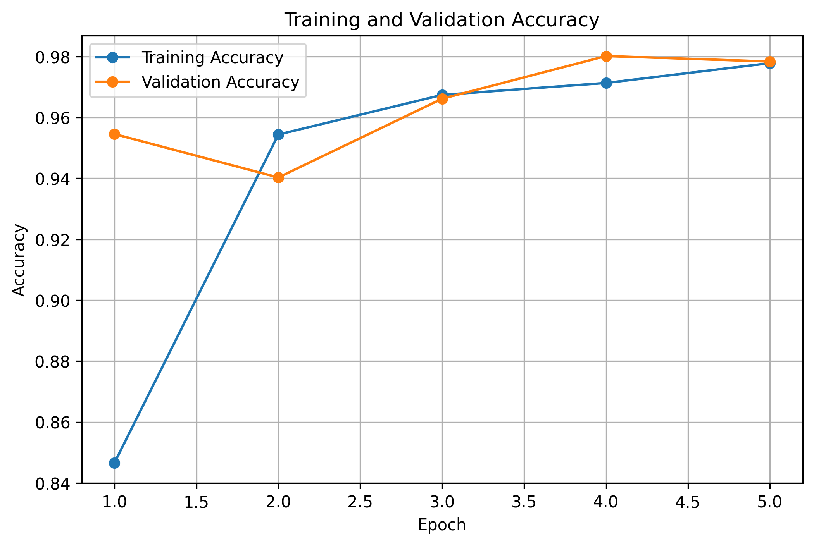
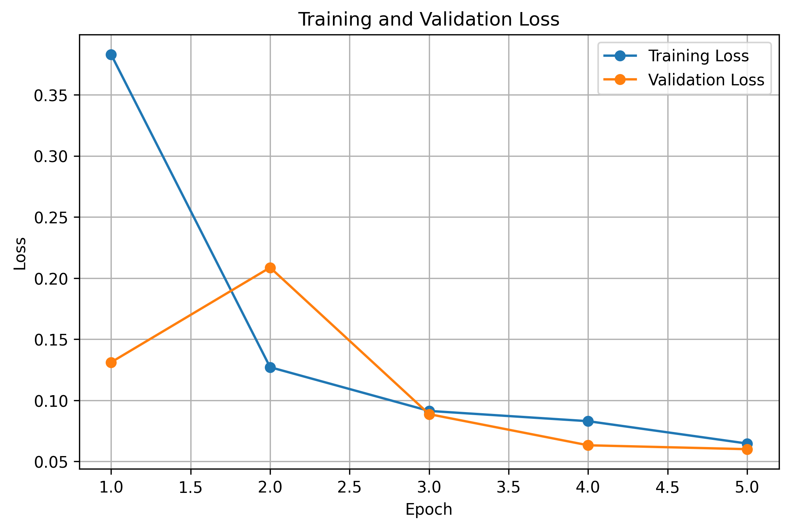
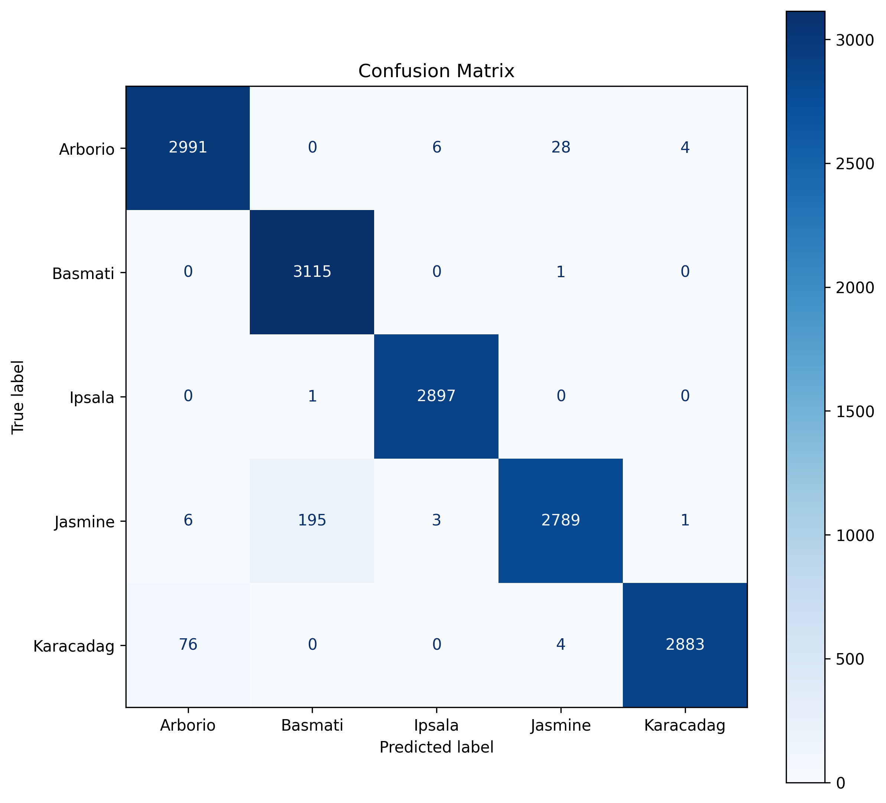
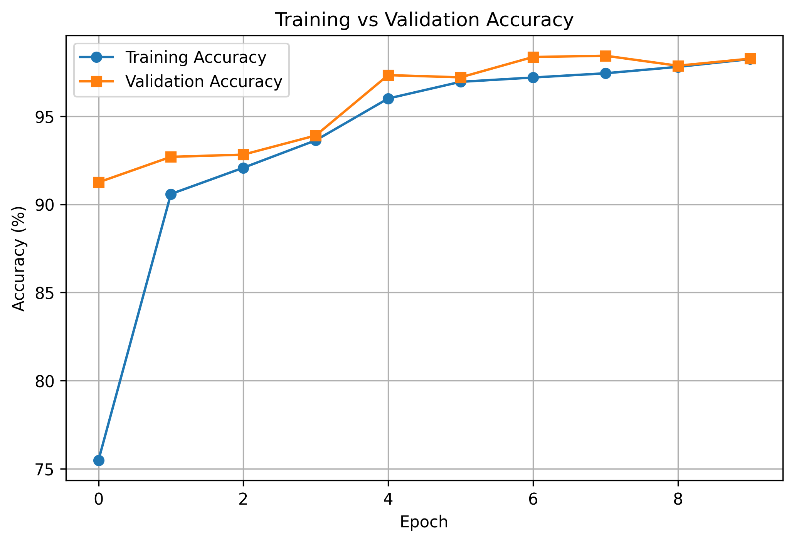
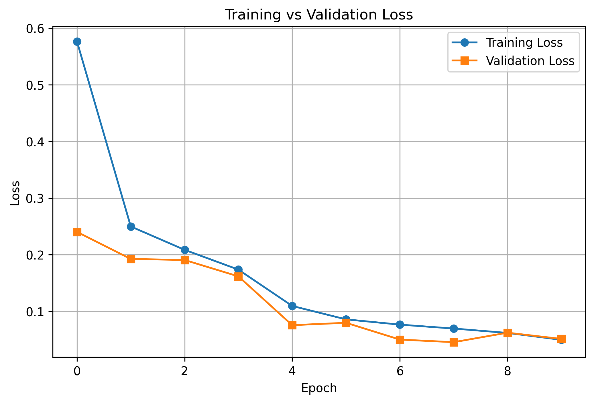
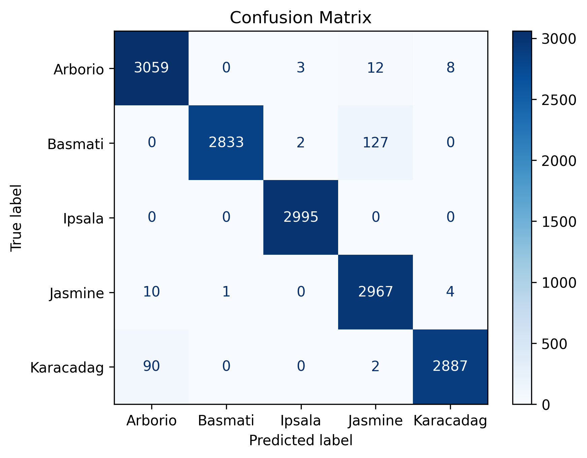

# Rice Image Classification using TensorFlow and PyTorch

## Project Overview

This project presents an end-to-end deep learning pipeline for classifying rice varieties using Convolutional Neural Networks (CNNs) implemented with both TensorFlow and PyTorch.

The models are trained on the Rice Image Dataset and classify rice images into five different varieties: Arborio, Basmati, Ipsala, Jasmine, and Karacadag.

The project covers the complete machine learning workflow, including dataset exploration, image preprocessing, model training, validation, performance evaluation, model saving, and inference on unseen rice images.

Separate inference pipelines are provided for TensorFlow and PyTorch, allowing users to load a trained model, preprocess a new image, predict its rice variety, and display the prediction confidence.

## Dataset

The models are trained on the **Rice Image Dataset**, a large image dataset containing five different rice varieties.

### Rice Classes

- Arborio
- Basmati
- Ipsala
- Jasmine
- Karacadag

### Dataset Information

- Total Images: **75,000**
- Number of Classes: **5**
- Images per Class: **15,000**
- Image Size: **250 × 250 pixels**
- Color Format: **RGB**

The dataset was downloaded directly from **Kaggle** using the Kaggle API.

For model development, the dataset was divided into:

- **80%** Training Set
- **20%** Validation Set


## Project Structure

```text
rice-classification-cnn/
│
├── images/
│
├── notebooks/
│   ├── 01_dataset_inspection.ipynb
│   ├── 02_tensorflow_cnn.ipynb
│   ├── 03_tensorflow_inference.ipynb
│   ├── 04_pytorch_cnn.ipynb
│   └── 05_pytorch_inference.ipynb
│
├── results/
│   ├── tensorflow/
│   └── pytorch/
│
├── README.md
├── requirements.txt
└── .gitignore
```

## Project Preview

The following figures summarize the training and evaluation results of both TensorFlow and PyTorch implementations.

### TensorFlow

#### Training Accuracy



#### Training Loss



#### Confusion Matrix



---

### PyTorch

#### Training & Validation Accuracy



#### Training & Validation Loss



#### Confusion Matrix



## TensorFlow Implementation

The TensorFlow implementation provides a complete deep learning pipeline using TensorFlow and Keras.

The workflow includes:

- Loading the Rice Image Dataset
- Image preprocessing and normalization
- Building a custom CNN architecture
- Training and validating the model
- Evaluating model performance
- Saving the trained model
- Running inference on unseen rice images

## PyTorch Implementation

The PyTorch implementation follows the same end-to-end workflow while leveraging PyTorch for model development and training.

The workflow includes:

- Loading the Rice Image Dataset
- Applying image transformations
- Building a custom CNN architecture
- Training and validating the model
- Evaluating model performance
- Saving model checkpoints
- Running inference on unseen rice images

  
## Training Results

The following table summarizes the performance of both implementations.

| Metric | TensorFlow | PyTorch |
|--------|-----------:|---------:|
| Validation Accuracy | 97.19% | 98.27% |
| Best Validation Accuracy | 98.56% | 98.44% |
| Number of Classes | 5 | 5 |
| Total Images | 75,000 | 75,000 |
| Image Size | 250 × 250 | 250 × 250 |


## Inference

Both TensorFlow and PyTorch implementations include a complete inference pipeline for predicting the class of unseen rice images.

The inference workflow includes:

- Loading a trained model
- Uploading a rice image
- Applying the required preprocessing steps
- Predicting the rice variety
- Displaying the prediction confidence
- Showing the probability distribution across all rice classes

## Installation

Clone the repository:

```bash
git clone https://github.com/kosar-am/rice-classification-cnn.git
```

Navigate to the project directory:

```bash
cd rice-classification-cnn
```

Install the required dependencies:

```bash
pip install -r requirements.txt
```
## Usage

The project is organized into five Jupyter notebooks:

| Notebook | Description |
|----------|-------------|
| `01_dataset_inspection.ipynb` | Explore and visualize the Rice Image Dataset |
| `02_tensorflow_cnn.ipynb` | Train and evaluate the TensorFlow CNN model |
| `03_tensorflow_inference.ipynb` | Perform inference using the trained TensorFlow model |
| `04_pytorch_cnn.ipynb` | Train and evaluate the PyTorch CNN model |
| `05_pytorch_inference.ipynb` | Perform inference using the trained PyTorch model |

## Technologies Used

- Python
- TensorFlow
- PyTorch
- NumPy
- Matplotlib
- scikit-learn
- Pillow
- Kaggle API
- Jupyter Notebook

## Author

**Kosar Amini**

GitHub: **https://github.com/kosar-am**
